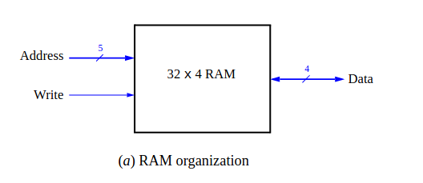
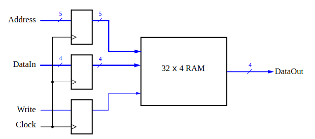
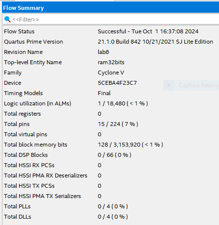
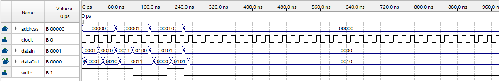
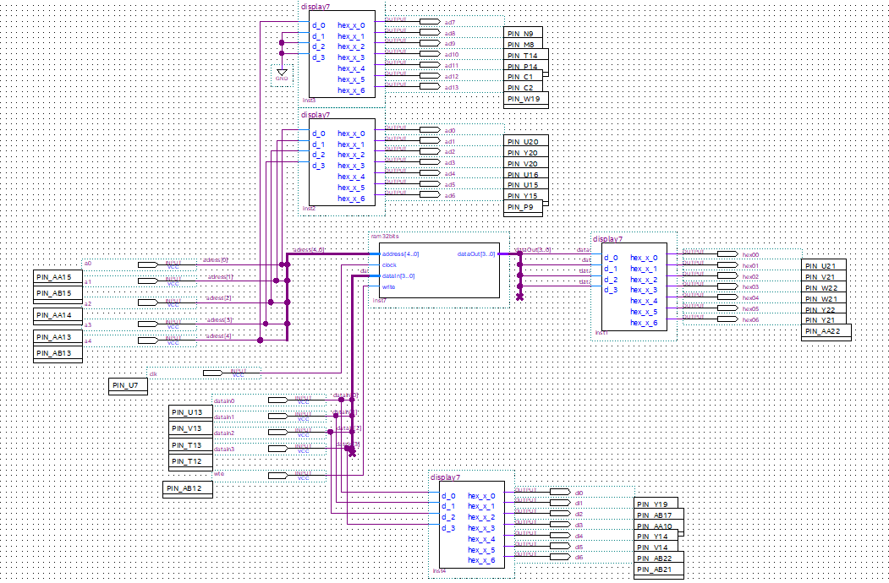

# SSC0108 - Prática-SD

[Laboratory Exercise 8 - Memory Blocks](img/lab8.pdf)

### Alunos

|        Nome                         |    NUSP   |       
|:-----------------------------------:|:---------:|  
|   Laura Fernandes Camargos          |  13692334 |   
|   Sandy da Costa Dutra       	      |  12544570 |   
|   Vitor Nishimura		                |  5255289  | 

# Softwares utilizados

Quartus Prime 21.1 <br>
Em sistemas computacionais é necessário fornecer uma quantidade substancial de memória. Se um sistema for implementado usando a tecnologia FPGA é possível fornecer alguma quantidade de memória usando os recursos de memória que existem no dispositivo FPGA. Neste exercício examinamos as questões gerais envolvidas na implementação de tais
memória. Um diagrama do módulo de memória de acesso aleatório (RAM) que implementamos é mostrado na figura abaixo. 

<div align ="center">
    
</div>

Esse diagrama contém 32 palavras (linhas) de quatro bits, que são acessadas usando uma porta de endereço de cinco bits, uma porta de dados de quatro bits e um controle de gravação entrada. Neste exercício usamos a FPGA Cyclone V DE0-CV que possui blocos M10K, onde cada bloco contém 10.240 bits de memória. Um termo comum usado para especificar o tamanho de uma memória é sua proporção de aspecto, que fornece a profundidade em palavras e a largura em bits (profundidade x largura). Neste exercício, usaremos uma proporção de aspecto de quatro bits de largura e usaremos apenas as primeiras 32 palavras na memória.

## Part I

Estruturas lógicas comumente usadas, como somadores, registradores, contadores e memórias, podem ser implementadas em um chip FPGA usando módulos pré-construídos que são fornecidos em bibliotecas. Neste exercício, usaremos tal módulo para implementar a memória mostrada na figura abaixo:

<div align ="center">
    
</div>

### Arquivo VHDL ram32x4.vhd:
```
ENTITY ram32x4 IS
PORT ( address : IN STD_LOGIC_VECTOR (4 DOWNTO 0);
clock : IN STD_LOGIC := ’1’;
data : IN STD_LOGIC_VECTOR (3 DOWNTO 0);
wren : IN STD_LOGIC ;
q : OUT STD_LOGIC_VECTOR (3 DOWNTO 0) );
END ram32x4;
```
Ao compilar o circuito com os sinais dd entrada e saída foi observado no Relatório de Compilação que o Compilador Quartus usa 128 bits em um dos blocos de memória FPGA para implementar o circuito RAM.

<div align ="center">
    
</div>

Simulação do comportamento do nosso circuito:
<div align ="center">
    
</div>


## Part II
Uma vez compilado e simulado o circuito, foi feita a configuração da FPGA Cyclone V DE0-CV para testar o circuito de fato. Fora usados os switches SW3−0 para fornecer dados de entrada para a RAM e os switches SW8−4 para especificar o endereço. O switch SW9 foi usado como o sinal de gravação e o KEY0 como a entrada do relógio. O valor do endereço foi mostrado nos displays de 7 segmentos HEX5 − 4, os dados que estão inseridos na memória foram mostrados no HEX2 e os dados lidos da memória no HEX0.

Circuito do nosso esquema no quartus com os pinos já configurados:

<div align ="center">
    
</div>

[Link para o projeto implementado no Quartus](quartus/part1/praticaram)

	
## Part III

Agora, em vez de criar um subcircuito de módulo de memória usando o IP Catalog do Quartus, implementamos a memória necessária especificando sua estrutura em código VHDL. Em um design especificado por VHDL, é possível definir a memória como uma matriz multidimensional.

Uma matriz 32 x 4, que tem 32 palavras com 4 bits por palavra, pode ser declarada pela seguinte declaração:

```
TYPE mem IS ARRAY(0 TO 31) OF STD_LOGIC_VECTOR(3 DOWNTO 0);
SIGNAL memory_array : mem;
```

Em uma FPGA, tal matriz pode ser implementada usando os flip-flops que cada elemento lógico contém ou, mais eficientemente, usando os blocos de memória integrados.

### Codigo VHDL:

```
LIBRARY ieee;
USE ieee.std_logic_1164.ALL;
USE ieee.std_logic_unsigned.ALL;

ENTITY ram32bits IS
    PORT (
        address  : IN  STD_LOGIC_VECTOR(4 DOWNTO 0); -- 5-bit address for 32 locations
        clock    : IN  STD_LOGIC;
        dataIn   : IN  STD_LOGIC_VECTOR(3 DOWNTO 0); -- 4-bit input data
        wrt      : IN  STD_LOGIC; -- write enable signal
        --dataOut  : OUT STD_LOGIC_VECTOR(3 DOWNTO 0); -- 4-bit output data
        hex0     : OUT STD_LOGIC_VECTOR(6 DOWNTO 0); -- data out
        hex1     : OUT STD_LOGIC_VECTOR(6 DOWNTO 0); -- data in
        hex2     : OUT STD_LOGIC_VECTOR(6 DOWNTO 0); -- mem digit 1
        hex3     : OUT STD_LOGIC_VECTOR(6 DOWNTO 0)  -- mem digit 2
    );
END ram32bits;

ARCHITECTURE Behavior OF ram32bits IS
    TYPE mem IS ARRAY(0 TO 31) OF STD_LOGIC_VECTOR(3 DOWNTO 0);
    SIGNAL memory_array : mem := (others => (others => '0'));

    FUNCTION to_7_segment(data : STD_LOGIC_VECTOR(3 DOWNTO 0)) RETURN STD_LOGIC_VECTOR IS
    BEGIN
        CASE data IS
            WHEN "0000" => RETURN "0000001"; -- 0
            WHEN "0001" => RETURN "1001111"; -- 1
            WHEN "0010" => RETURN "0010010"; -- 2
            WHEN "0011" => RETURN "0000110"; -- 3
            WHEN "0100" => RETURN "1001100"; -- 4
            WHEN "0101" => RETURN "0100100"; -- 5
            WHEN "0110" => RETURN "0100000"; -- 6
            WHEN "0111" => RETURN "0001111"; -- 7
            WHEN "1000" => RETURN "0000000"; -- 8
            WHEN "1001" => RETURN "0001100"; -- 9
            WHEN "1010" => RETURN "0001000"; -- A
            WHEN "1011" => RETURN "1100000"; -- B
            WHEN "1100" => RETURN "0110001"; -- C
            WHEN "1101" => RETURN "1000010"; -- D
            WHEN "1110" => RETURN "0110000"; -- E
            WHEN "1111" => RETURN "0111000"; -- F
            WHEN OTHERS => RETURN "1111111"; -- Blank or error
        END CASE;
    END FUNCTION;

    FUNCTION bit_to_7_segment(data : STD_LOGIC) RETURN STD_LOGIC_VECTOR IS
    BEGIN
        CASE data IS
            WHEN '0' => RETURN "0000001"; -- 0
            WHEN '1' => RETURN "1001111"; -- 1
            WHEN OTHERS => RETURN "1111111"; -- Blank or error
        END CASE;
    END FUNCTION;

BEGIN
    PROCESS (clock)
    BEGIN
        IF rising_edge(clock) THEN
            IF wrt = '1' THEN
                memory_array(CONV_INTEGER(address)) <= dataIn;
            END IF;
            --dataOut <= memory_array(CONV_INTEGER(address)); -- Update the dataOut with the read value
            hex0 <= to_7_segment(memory_array(CONV_INTEGER(address))); -- data out
				hex1 <= to_7_segment(dataIn); -- data in
				hex2 <= to_7_segment(address(3 DOWNTO 0)); -- Display lower 4 bits of address
				hex3 <= bit_to_7_segment(address(4)); -- Display highest bit of address as a single bit
        END IF;
		  
    END PROCESS;
END Behavior;

```
Uma vez compilado o circuito, foi testado a funcionalidade do nosso projeto aplicando algumas entradas e saídas para a FPGA DEO-CV.

[Link para o projeto implementado no Quartus](quartus/part3/ram_part3/)


## Part IV

Para esta parte da prática,foi criado um tipo diferente do módulo de memória apresentado na Part I, no qual há uma porta para fornecer o endereço para uma operação de leitura e uma porta separada que fornece o endereço para uma operação de gravação. Foram executadas as seguintes etapas:

### 1.

| Count | Characters   |
|-------|--------------|
| 00    | d E 0        |
| 01    | E 0 d        |
| 10    | 0 d E        |
| 11    | d E 0        |


### Codigo VHDL:

```
library ieee;
use ieee.std_logic_1164.all;
use ieee.std_logic_unsigned.all;
use ieee.std_logic_arith.all;

entity DisplayController is
    port (
        clk     : in std_logic;
        rst     : in std_logic;
		  enb     : in std_logic;
        seg     : out std_logic_vector(27 downto 0)  -- 7-segment display output

    );
end DisplayController;

architecture Behavioral of DisplayController is
    signal tick       : std_logic := '0';
    signal sec_counter: std_logic_vector(25 downto 0) := (others => '0');
    signal digit      : std_logic_vector(1 downto 0) := (others => '0');
begin

    -- 1-second timer
    process (clk, rst)
    begin
        if rst = '1' then
            sec_counter <= (others => '0');
            tick <= '0';
        elsif rising_edge(clk) and enb = '1' then
            if sec_counter = "10111110101100100000000000" then
                sec_counter <= (others => '0');
                tick <= '1';
            else
                sec_counter <= sec_counter + 1;
                tick <= '0';
            end if;
        end if;
    end process;

    -- 2-bit counter
    process (clk, rst)
    begin
        if rst = '1' then
            digit <= (others => '0');
        elsif rising_edge(clk) and enb = '1' then
            if tick = '1' then
                if digit = "11" then
                    digit <= (others => '0');
                else
                    digit <= digit + 1;
                end if;
            end if;
        end if;
    end process;

    -- 7-segment display decoder
    process (digit)
    begin
        case digit is
				when "00" => seg <= "0000001011000010000101111111"; -- 0ed_
				when "01" => seg <= "1111111000000101100001000010"; -- _0ed
				when "10" => seg <= "1000010111111100000010110000"; -- d_0e
				when "11" => seg <= "0110000100001011111110000001"; -- ed_0
				when others => seg <= (others => '0'); -- default to all segments off (if needed)
        end case;
		  -- _ = "1111111"
		  -- e = "0110000"
		  -- d = "1000010"
		  -- 0 = "0000001"
    end process;

end Behavioral;
```
[Link para o projeto implementado no Quartus](quartus/part4/)

## Part V
Como usamos a FPGA DEO-CV (placa pequena), a palavra é a ser rotacionada nos 6 displays deve ser dE0:

| Count | Character Pattern |
|-------|-------------------|
| 000   | d E 0             |
| 001   | E 0 d             |
| 010   | 0 d E             |
| 011   | d E 0             |
| 100   | E 0 d             |
| 101   | 0 d E             |


### Codigo VHDL:

```
library ieee;
use ieee.std_logic_1164.all;
use ieee.std_logic_unsigned.all;
use ieee.std_logic_arith.all;

entity DisplayController is
    port (
        clk     : in std_logic;
        rst     : in std_logic;
		  enb     : in std_logic;
        seg     : out std_logic_vector(41 downto 0)  -- 7-segment display output
    );
end DisplayController;

architecture Behavioral of DisplayController is
    signal tick       : std_logic := '0';
    signal sec_counter: std_logic_vector(25 downto 0) := (others => '0');
    signal digit      : std_logic_vector(2 downto 0) := (others => '0');
begin

    -- 1-second timer
    process (clk, rst, enb)
    begin
        if rst = '1' then
            sec_counter <= (others => '0');
            tick <= '0';
        elsif rising_edge(clk) and enb='1' then
            if sec_counter = "10111110101100100000000000" then
                sec_counter <= (others => '0');
                tick <= '1';
            else
                sec_counter <= sec_counter + 1;
                tick <= '0';
            end if;
        end if;
    end process;

    -- 2-bit counter
    process (clk, rst, enb)
    begin
        if rst = '1' then
            digit <= (others => '0');
        elsif rising_edge(clk) and enb='1' then
            if tick = '1' then
                if digit = "101" then
                    digit <= (others => '0');
                else
                    digit <= digit + 1;
                end if;
            end if;
        end if;
    end process;

    -- 7-segment display decoder
    process (digit)
    begin
        case digit is
				when "000" => seg <= "000000101100001000010111111111111111111111"; -- 0ed___
				when "001" => seg <= "111111100000010110000100001011111111111111"; -- _0ed__
				when "010" => seg <= "111111111111110000001011000010000101111111"; -- __0ed_
				when "011" => seg <= "111111111111111111111000000101100001000010"; -- ___0ed
				when "100" => seg <= "100001011111111111111111111100000010110000"; -- d___0e
				when "101" => seg <= "011000010000101111111111111111111110000001"; -- ed___0
				when others => seg <= (others => '0'); -- default to all segments off (if needed)
        end case;
		  -- _ = "1111111"
		  -- e = "0110000"
		  -- d = "1000010"
		  -- 0 = "0000001"
    end process;

end Behavioral;

```
[Link para o projeto implementado no Quartus](quartus/part5/)
